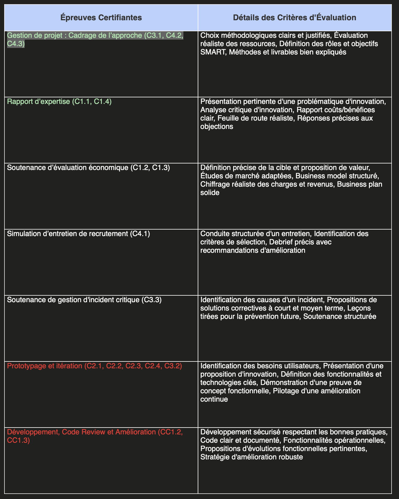

# Projet Fil Rouge - MT5 2025

Vous trouverez ici toutes les informations et les dates relatives à votre projet de fin d'études.

Au fur et à mesure que des informations seront disponibles, je les ajouterai ici pour votre commodité.

### Groupes

La liste de groupes se trouve ici : [https://docs.google.com/spreadsheets/d/1MJZ-lTkJXRBUQpsG5t69zW8h8CfmMug5sSo8M-I-z0E/edit?gid=0#gid=0](https://docs.google.com/spreadsheets/d/1MJZ-lTkJXRBUQpsG5t69zW8h8CfmMug5sSo8M-I-z0E/edit?gid=0#gid=0)

### Dates clés

| Date                                                              | Description                                                                                                                                                                                                                                                                                  | Livrable                                                                                                                                                                                                                                                                                                                                                                                                                                                                                                                                                                                                                        |
| ----------------------------------------------------------------- | -------------------------------------------------------------------------------------------------------------------------------------------------------------------------------------------------------------------------------------------------------------------------------------------- | ------------------------------------------------------------------------------------------------------------------------------------------------------------------------------------------------------------------------------------------------------------------------------------------------------------------------------------------------------------------------------------------------------------------------------------------------------------------------------------------------------------------------------------------------------------------------------------------------------------------------------- |
| Lundi 2 juin                                                      | Kickoff et validation officielle des projets (rdv obligatoire avec Kevin)                                                                                                                                                                                                                    |                                                                                                                                                                                                                                                                                                                                                                                                                                                                                                                                                                                                                                 |
| Jeudi 5 juin/Vendredi 6 juin                                      | Point longue avec Kevin. Je veux voir les débuts d’un analyse profonde du sujet et la stratégie à suivre pour chaque projet. Ceci servira comme base pour le documents écrit à soumettre. Mes commentaires / critiques doivent être notés et des correctifs apportés.                        | 
Brouillon de départ pour le document écrit à rendre, couvrant : 
<ul><li>C3.1, C4.2, C4.3 : Choix méthodologiques clairs et justifiés, Évaluation réaliste des ressources, Définition des rôles et objectifs SMART, Méthodes et livrables bien expliqués</li><li>C1.1, C1.4 : Présentation pertinente d'une problématique d'innovation, Analyse critique d'innovation, Rapport coûts/bénéfices clair, Feuille de route réaliste, Réponses précises aux objections</li><li>Un schema global de l’architecture de votre plateforme détaillant les différents composants / modules et leur interoperabilité</li></ul>

 |
| Jeudi 12 juin                                                     | RDV ponctuelle pour me rassurer que les commentaires ont été bien intégrés et que vous êtes sur la bonne piste                                                                                                                                                                               |                                                                                                                                                                                                                                                                                                                                                                                                                                                                                                                                                                                                                                 |
| Mardi 8 juillet et jeudi 10 juillet (dates précises à confirmer)  | <ul><li>Point d’avancement et correctif</li><li>La base de votre architecture doit être implémenté</li><li>Un vertical slice fonctionnel </li><li>Un schéma global de l’infrastructure de déploiement doit être prêt</li><li>Fourniture des ressources de déploiement à la demande</li></ul> | Vertical slice qui fonctionne                                                                                                                                                                                                                                                                                                                                                                                                                                                                                                                                                                                                   |
| Fin août                                                          | La version finale de votre document écrit doit être soumise, en plus de l'affiche technique                                                                                                                                                                                                  | <ul><li>Livrable écrit</li><li>Affiche technique</li></ul>                                                                                                                                                                                                                                                                                                                                                                                                                                                                                                                                                                      |
| Mardi 9 septembre, jeudi 11 septembre                             | <ul><li>Point d’avancement et correctif</li><li>Une démo à 80% doit être fonctionnelle</li><li>Les débuts de la presentation orale en place</li></ul>                                                                                                                                        | Démo à 80%                                                                                                                                                                                                                                                                                                                                                                                                                                                                                                                                                                                                                      |
| Jeudi 18, vendredi 19 septembre                                   | Oraux blans                                                                                                                                                                                                                                                                                  | Présentation et supports prêts à 95 % avec une démo entièrement fonctionnelle (déployée en production).                                                                                                                                                                                                                                                                                                                                                                                                                                                                                                                         |
| Date à confirmer                                                  | Jour de l'exposition                                                                                                                                                                                                                                                                         | Les affiches techniques seront imprimées et exposées dans l'école. Chaque équipe doit présenter et défendre leur travail devant leur affiche, expliquer et répondre aux questions des étudiants et staff.                                                                                                                                                                                                                                                                                                                                                                                                                       |

### Rendu écrit

[Cliquez ici pour plus d'information sur les contenus du rapport](./src/rapport.md)

Le tableau suivant detaille les attentes par rapport au titre RNCP :

* en vert : à l'écrit, à rendre fin juillet (Brontis va en parler plus tard dans le programme),
* en blanc : à valider en juillet - pendant votre semaine il y aura un "workshop business" dans lequel vous aborderez ces sujets,
* en rouge : oraux finaux et code-review du projet fil rouge

<figure><figcaption></figcaption></figure>

### L'affiche technique (poster)

Vous préparerez une affiche détaillée qui explique de manière concise et attrayante l'objectif de votre projet, ses défis, son architecture technique et ses résultats.

Cela ressemble aux affiches que l'on voit couramment dans les conférences universitaires et les salons professionnels. Ceux-ci sont également très souvent produits par des profils de niveau master, comme vous.

Voici un exemple que j'ai produit et présenté lors d'une conférence internationale pendant mon master (bien avant l'arrivée des LLM).

<figure><figcaption></figcaption></figure>
